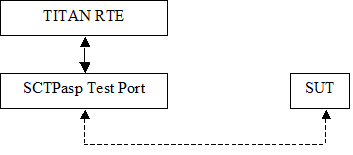

= SCTPasp Test Port for TTCN-3 Toolset with TITAN, Function Specification
:author: Péter Dimitrov
:revnumber: 155 17-CNL 113 469, Rev. B
:revdate: 2006-08-21
:toc:

== How to Read This Document

This is the Function Specification for the SCTPasp test port. The SCTPasp test port is developed for the TTCN-3 Toolset with TITAN.

== Scope

The purpose of this document is to specify the functionality of the SCTPasp test port. The document is primarily addressed to the end users of the product. Basic knowledge of TTCN-3 and TITAN TTCN-3 Test Executor is valuable when reading this document (see ‎<<_1, [1]>> and ‎<<_3, [3]>>).

This document is based on specifications of Stream Control Transmission Protocol (SCTP) defined by https://tools.ietf.org/html/rfc2960[RFC 2960] and on Socket API Extensions for Stream Control Transmission Protocol <<_5, ‎[5]>>.

= General

The SCTPasp Test Port makes it possible to execute test suites towards a SUT. The test port offers SCTP primitives to the test suite and communicates with the SUT.

The communication between the SCTPasp test port and the TITAN RTE is done by using the API functions described in ‎<<_3, [3]>>. The SCTPasp test port then transfers the SCTP messages to the SUT.

See the overview of the system below:

= Function Specification

== Implementation

The SCTP layer is implemented in the kernel of the operating system. The test port implements the communication between the SCTP socket and the TTCN-3 SCTP ASPs. The test port can work in two modes: simple mode and normal mode. The selection between these main modes is controlled by a test port parameter (`simple_mode`).

In simple mode the test port can work in two submodes: as a client (maintaining only one connection at a time) or as a server (maintaining several client connections at the same time). One-to-one style sockets are used in both client and server submodes. There is a special reconnect mode when the test port is used as a client. In reconnect mode the client automatically connect to an arbitrary server. If the connection fails a reconnection procedure will be initiated. This procedure will block the RTE, it is strongly recommended not to use the test port in reconnect mode.

In normal mode the test port can handle arbitrary number of servers and clients at the same time. The table shows all available modes of the test port:

|===
2+^.^|*Simple mode* .3+^.^|*Normal mode*
|*Client* .2+^.^|*Server*
|`Reconnect`
|===

NOTE: While in simple mode the test port is backward compatible to the previous version of the SCTPasp test port, in normal mode there are several functional and semantic differences. For more information refer to <<_4, [4]>>.

=== Module Structure

The SCTPasp test port is implemented in the following TTCN-3 blocks:

* __SCTPasp_Types.ttcn__
* __SCTPasp_PortType.ttcn__

The file __SCTPasp_Types.ttcn__ defines the SCTP ASPs. The port type is defined in __SCTPasp_PortType.ttcn__.

The C++ implementation of the test port is contained in the following files:

* __SCTPasp_PT.hh__
* __SCTPasp_PT.cc__

== Configuration

The configuration of the SCTPasp test port is done by the TITAN RTE configuration file. Beside the address and the port of the server and the operation mode several other SCTP layer options can be given as port parameters. When the operation mode is set to client, the port will operate as SCTP client socket, trying to connect to the given address and port. In case of server operation mode, the port will start an SCTP server on the given port and will be listening for new connections from client ports. In normal mode the test port can handle multiple client and server sockets at the same time.

NOTE: Almost every parameter can be set by ASPs too. In normal mode this is the only way to configure several client and server sockets properly. For more information about configuring the test port refer to ‎<<_4, [4]>>.

== Start Procedure

After the configuration is done, the user has to make sure that the target system is up and running. When the executable test suite is started it initializes the SCTP socket. After the start procedure the SCTP server type port is already listening for server connections. In the case of using test ports in client mode the connection to the server can be automatic too when they are in reconnect mode. In normal mode all type of connections shall be initiated manually by sending out the proper ASPs.

== Connecting the SCTP Ports

In simple mode the SCTP connection is initiated by the client type port, and is set up by sending an `ASP_SCTP_Connect` abstract service primitive. After the connection has been set up, transmission of the ASPs can begin. The `ASP_SCTP_Connect` primitive is restricted to be used only in client mode. Using it in server mode will result a TTCN error. As it was mentioned above there is another way to connect to an arbitrary server port, setting reconnect mode. In normal mode arbitrary number of `ASP_SCTP_Connect`, `ASP_SCTP_ConnectFrom` can be sent. Beside the clients arbitrary number of servers can be started too by sending `ASP_SCTP_Listen`.

[[sending-receiving-sctp-asps]]
== Sending/Receiving SCTP ASPs

When the communication between the SCTP test port and the target system is set up, the test port starts translating the SCTP primitives to SCTP packets (and vice versa) between the TITAN RTE and the SUT. For more information about available ASPs and there usage please refer to ‎<<_4, [4]>>.

== Debugging

The type of information that will be logged can be categorized into two groups. The first one consists of information that shows the flow of the internal execution of the test port, for example, important events, which function that is currently executing etc. The second group deals with presenting valuable data, for example, presenting the content of a PDU. The logging printouts will be directed to the RTE log file. The user is able to decide whether logging is to take place or not by setting appropriate configuration data.

== Error Handling

Erroneous behavior detected during runtime is shown on the console and directed into the RTE log file. The following two types of messages are taken care of:

* Errors - information about errors detected is provided. If an error occurs the execution stops immediately.
* Warnings - information about warnings detected is provided. The execution continues after the warning is shown.

== Closing Down

After the test port has executed all test cases it will stop automatically. It will close down the SCTP socket towards the SUT and terminate.

The execution of the test suite can be stopped at any time by pressing `<Ctrl>-c`. Even when execution is interrupted with `<Ctrl>-c` the socket is still closed.

= Limitations

Supported platforms: Solaris 10, SUSE Linux 9.1 and above.

Multihoming is not supported. If you use the SCTPasp Test Port on a machine with multiple interfaces then by default an arbitrary IP address will be chosen for the SCTP socket. So in this case it is recommended to specify the bind address in the TITAN RTE configuration file. In normal mode both the client and server type ports can choose a bind address by `ASP_SCTP_ConnectFrom` and `ASP_SCTP_Listen`.

IPv6 is not supported.

= Terminology

*Sockets:* +
The sockets is a method for communication between a client program and a server program in a network. A socket is defined as "the endpoint in a connection." Sockets are created and used with a set of programming requests or "function calls" sometimes called the sockets application-programming interface (API). The most common socket API is the Berkeley UNIX C language interface for sockets. Sockets can also be used for communication between processes within the same computer.

= Abbreviations

API:: Application Program Interface

ASP:: Abstract Service Primitive

RTE:: Run-Time Environment

SCTP:: Stream Control Transmission Protocol

SUT:: System Under Test

TTCN-3:: Testing and Test Control Notation version 3

= References

[[_1]]
[1] ETSI ES 201 873-1 v3.1.1 (2005-06) +
The Testing and Test Control Notation version 3; Part 1: Core Language

[[_2]]
[2] TITAN User Guide

[[_3]]
[3] Programmer’s Technical Reference for TITAN TTCN-3 Test Executor

[[_4]]
[4] SCTPasp Test Port for TTCN-3 Toolset with TITAN, User’s Guide

[[_5]]
[5] Socket API Extensions for Stream Control Transmission Protocol (SCTP) +
https://tools.ietf.org/html/draft-ietf-tsvwg-sctpsocket-10

[[_6]]
[6] https://tools.ietf.org/html/rfc2960[RFC 2960] (2000) +
Stream Control Transmission Protocol
